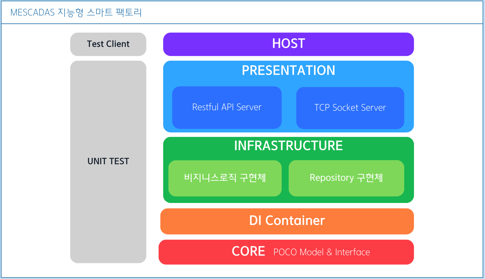
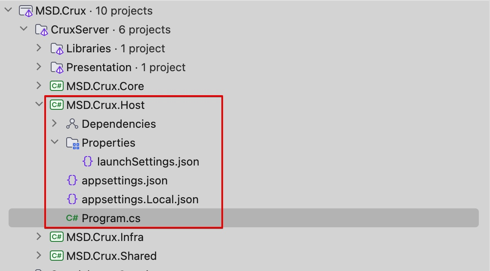

# Crux Server

## ■ Application Architecture

`CruxServer`는 아래와 같은 계층형 구조로 이루어져있습니다:

- Host
- Presentation
- Infrastructure
- DI (.Shared)
- Core

## ■ HOST 프로젝트

Host는 MSD Crux 서버의 실행 진입점으로, 클라이언트 요청에 대해 Presentation 계층의 각 엔드포인트에대한 라우트 매핑을 담당합니다.

Host 프로젝트는 CruxServer 솔푸션폴더 내의 유일한 실행 타입 프로젝트이며, `MSD.Crux.Host`의 `Program`클래스는 MSD Crux 서버의 진입점입니다. 클라이언트가 요청하는 각 Presentation으로 라우트합니다.

### 환경변수와 구성파일

MSD Crux는 ASP.NET 구성파일 (appsettngs.json)을 통해서도 JWT 시크릿 키, DB 커넥션 스트링등의 정보룰 로드할 수 있습니다 (OS의 환경변수 직접제공하거나 실행파일 명령줄 옵션을 통한
설정보다 우선순위 낮음) .

MSD Crux는 ASPNETCORE_ENVIRONMENT 환경에 맞는 환경 구성파일을 로드하며 .NET 환경변수 `ASPNETCORE_ENVIRONMENT`의 값은 다음 중 하나임을 상정합니다:

- `Local` : 개발용 로컬 컴퓨터 환경 구성
- `Development` : dev 서버용 환경 구성
- `Production` : prod 서버용 환경 구성

IDE상의 실행 환경은 `launchSettings.json`의 프로파일 중 `environmentVariables:ASPNETCORE_ENVIRONMENT` 의 값을 변경하여 실행하면 됩니다.

<pre style="background: #f9f9f9; border: 1px solid #ccc; border-radius: 5px; padding: 16px; font-family: monospace; line-height: 1.2; margin-bottom:1.5rem;">
"profiles": {
    "http": {
        "commandName": "Project",
        "dotnetRunMessages": true,
        "launchBrowser": true,
        "launchUrl": "swagger",
        "applicationUrl": "http://localhost:5282",
        "environmentVariables": {
          "ASPNETCORE_ENVIRONMENT": "<strong><em>Local</em></strong>"
        }
    }
}
</pre>

#### 환경별 구성 파일

 `appsettings.{환경}.json` 파일 중 다음 두 파일에대해서는 Git이 트래킹하지 않습니다(gitignore에 등록되어있음).
- appsettings.`Development`.json
- appsettings.`Production`.json

두 파일은 각각 dev 서버와 prod 서버 배포시 포함할 수 있는 파일로, JWT 시크릿키, DB 커넥션스트링을 적어둘 수 있습니다.
로컬 컴퓨터 개발 환경에서만 사용되어야할 `appsettings.Local.json `파일이 샘플로서 포함되어있습니다. 이 파일을 참고하여 각 서버에 배포시에는 그에 맞는 구성파일을 직접 생성, 포함해 배포 해야 합니다.

> [!IMPORTANT]
> appsettings.json 혹은 appsettings.Local.json 파일에는 실제 서버 또는 DB의 비밀정보를 작성하지 마십시오. 이 파일들은 Git 트래킹되므로 외부에 공개됩니다.
> 환경 구성 파일의 비밀정보 보호에 대해서는 추가로 [환경별 서버 구성과 Git 브랜치 전략](https://github.com/KyleOpenGit/Msd-Crux-repo/blob/main/README-docs/CONVENTIONS.md)의 내용을 읽어보시기 바랍니다.

> [!NOTE]
> 환경변수와 구성파일에 대한 기본내용은 MS Docs의 다음 문서를 참고 하십시오.
> - [ASP.NET Core의 옵션 패턴](https://learn.microsoft.com/ko-kr/aspnet/core/fundamentals/configuration/options?view=aspnetcore-8.0)
> - [ASP.NET Core에서 여러 환경 사용](https://learn.microsoft.com/ko-kr/aspnet/core/fundamentals/environments?view=aspnetcore-8.0)

