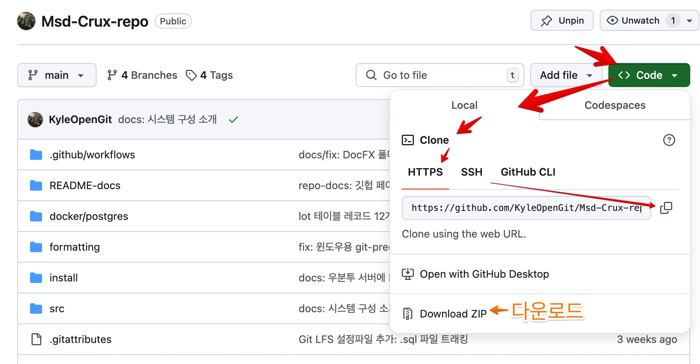

# 프로그래밍 가이드

## PREREQUISITES

- 개발
  - 환경:
    - .NET 8 SDK를 실행할 수 있는 OS
    - .NET 개발을 지원하는 IDE 또는 코드 에디터
    - .NET 8 SDK 이상이 설치된 환경
    - ASP .NET and web development 워크로드
  - 개발자:
    - C#과 .NET Core 개발에대한 기본적인 이해
    - CLI (명령줄 인터페이스)에대한 익숙함
    - Git 과 Github에대한 익숙함
- 실행파일 배포 환경 (서버 컴퓨터)
  - 필수:
    - .NET 8 및 ASP.NET 8 이상 Runtime 이 실행될 수 있는 Linux or Windows or macOS

## Git 레포지토리



[깃헙 레포지토리 페이지](https://github.com/KyleOpenGit/Msd-Crux-repo)의 `Code` 에서 URL을 복사해서 로컬 컴퓨터에서 Clone 하면 Git 커밋이력과 함께 복제됩니다.
Git 이력이 필요없다면 다운로드만 하세요.

```bash
git clone https://github.com/KyleOpenGit/Msd-Crux-repo.git
```

> [!NOTE]
> 새롭게 Clone 했을 때에는 자동 코드 포매팅을
위해 [Git pre-commit 훅 설정](https://github.com/KyleOpenGit/Msd-Crux-repo/blob/main/README-docs/PRE-COMMIT.md)을 참고 해주세요.

Crux 서버 소스코드가 있는 [Github 레포지토리](https://github.com/KyleOpenGit/Msd-Crux-repo)에는 닷넷 솔루션 뿐만 아니라 기타 다른 구성도 함께 합니다. 개발환경 기타 옵션에대해서는 Git레포지토리의 [README.md](https://github.com/KyleOpenGit/Msd-Crux-repo/blob/main/README.md) 내용을 참고하세요.
