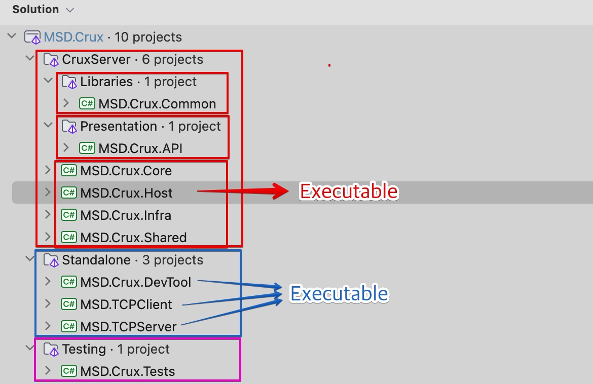

# 솔루션 구조

MSD.Crux 닷넷 솔루션은 여러 닷넷 프로젝트로 이루어져 있으며, Git repository의 root 하위에 `src/MSD.Crux`폴더가 닷넷 솔루션의 작업 디렉토리(Working Directory)입니다.
Git 루트 디렉토리를 열어도 대부분의 IDE에서 닷넷 솔루션과 프로젝트를 잘 표시하게 될 것입니다.

~~~
msd-crux-repo/
├── src/
│   ├── DocFX
│   └── MSD.Crux/  # working directory
│       └── MSD.Crux.sln
│       └── # 다른 닷넷 프로젝트 폴더들
│       └── .editorconfig
│       └── global.json
├── # 기타
└── README.md
~~~

컴퓨터 폴더구조로는 나타나지 않지만, 닷넷의 [솔루션 폴더](https://learn.microsoft.com/ko-kr/visualstudio/ide/solutions-and-projects-in-visual-studio?view=vs-2022#solution-folder) 구조를 지원하는 IDE에서 열게되면 아래처럼 각 프로젝트가 나누어져있습니다.

- CruxServer : MSD Crux 서버 애플리케이션
    - MSD.Crux.Host : 실행파일 프로젝트
- Standalone : 각각의 프로젝트가 독립적으로 실행가능한 애플리케이션
    - TCPServer: 별도로 분리된 MSD Crux 서버의 TCP 소켓 통신 서버 애플리케이션
    - DevTool: CLI 명령어 프로그램 개발을 위한 콘솔 앱 프로젝트
    - TCPClient: MESCADAS 엣지클라이언트의 TCP 클라이언트 테스트코드
- Testing : 단위 테스트등의 코드를 위한 프로젝트

> [!Important]
> 각 프로젝트는 서로다른 참조 관계가 맺어져 있으므로 순환참조가 일어나지 않도록 주의 해야합니다.

## 멀티 프로젝트 실행
Executable type 프로젝트는 배포시 각각의 실행파일로 배포될 수 있습니다. IDE의 RUN/DEBUG 환경으로 동시 실행 가능합니다. 멀티 프로젝트를 실행하려면 각 IDE의 기능을 활용하세요:

- Visual Studio: `Multiple Startup Projects`
- Visual Studio Code : `Compound Launch Configuration`
- JetBrains Rider : `Compound Run/Debug Configuration`

