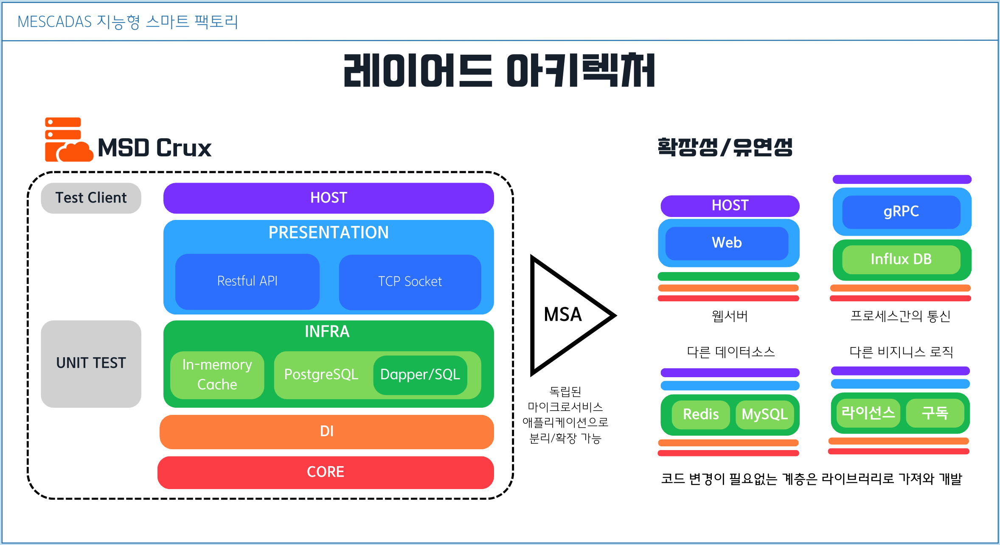
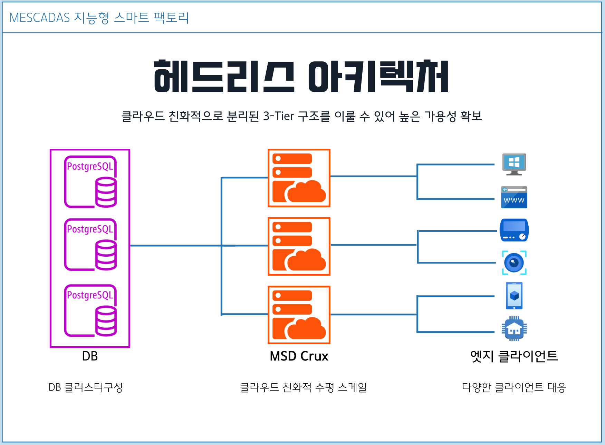
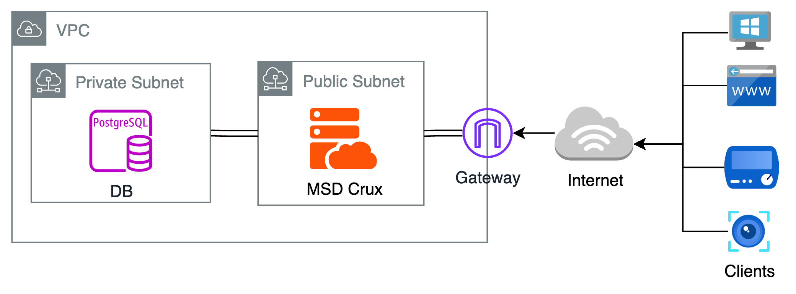
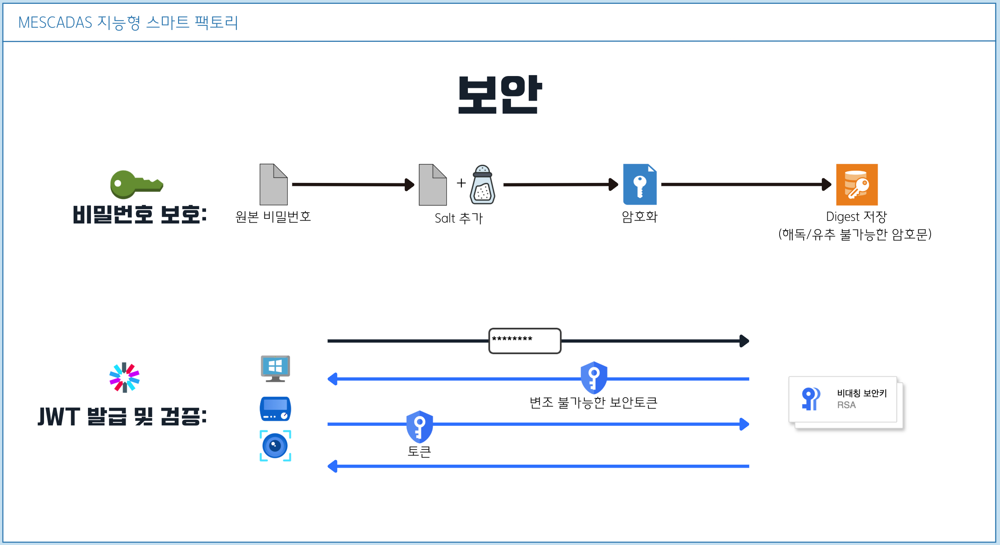

# MESCADAS Crux

MESCADAS Crux는 ***MESCADAS 프로젝트*** 의 중앙 서버 웹애플리케이션으로, MESCADAS 핵심 서비스의 관리와 조율을 위한 중심 허브 역할을 수행하도록 설계됩니다. 강력하고 고성능의 .NET
Core를 기반으로 구축된 MESCADAS Crux는 현대 애플리케이션을 위한 확장 가능하고 신뢰할 수 있는 기반을 제공합니다.
> 이하, MSD Crux

## MSD Crux 서버 기능

- 크로스 플랫폼 지원 (C# ASP.NET Core 8)
- 높은 확장성
- Restful API
- TCP Socket Server
- 비밀번호 암호화
- JWT (제이슨 웹 토큰) 발급 및 검증
- 독립적인 테스팅

## 애플리케이션 아키텍처

### LAYERED ARCHITECTURE

MSD Crux 서버의 코드는 계층형으로 나누어져 설계되었습니다. 이러한 계층형 모듈화는 기능 추가가 쉽습니다.

인프라스트럭처 계층에서는 In-Memory 저장소와 PostgreSQL DB 저장소만 다루는 SQL가 작성되어 있지만, 여기에 MySQL을 위한 코드를 추가 작성하여 언제든 상황에따라 원하는 코드로 동작되도록 선택할
수 있습니다.

프리젠테이션 계층에는 지금은 웹API 기능과 소켓통신 기능이 같은 서버에 있지만 각각 다른 애플리케이션으로 분리해낼 수 있습니다.

그리하여 여러기능을 독립적으로 분리한 마이크로 서비스로 확장하기 쉽게 설계 되었습니다.

이렇게 여러 기능으로 분리해 낼 때 변경이 필요없는 계층은 코드를 재작성하거나 복사할 필요 없이 라이브러리 파일로 임포팅해서 개발이 가능합니다.

이러한 분리구조는 또한 Unit Test를 가능케하여 각 계층별 코드를 독립적으로 테스팅할 수 있습니다.

### HEADLESS ARCHITECTURE

MSD Crux 서버는 데이터 저장/조회를 위한 플러그인방식의 인터페이스 설계, 그리고 표준화된 통신 API 구현으로인해 Database나 클라이언트의 기능과는 완전하게 분리된 구조의 헤드리스 아키텍처로 구성됩니다.

전체 시스템이 3-Tier 구조를 이룰 수 있어 클라우드 친화적으로 고가용성, 고성능의 서비스 제공을 꾀 할 수 있습니다

클라우드 배포시 데이터베이스는 클러스터링을 구성하고, Crux 서버 애플리케이션을 수평적 스케일링에 유리합니다.

또한 표준화된 API와 프로토콜 설계로 PC, MAC, 웹, 모바일, iOT 등 다양한 클라이언트가 만들어져도 손쉽게 대응 가능합니다.

## DB 보안 및 서버 보안

### 네트워크 보안
위와 같은 헤드리스 아키텍처를 기반으로 사설 VPC/SUBNET 구성을 통해서 Database를 보호 할 수 있습니다.

private subnet 구성을 통해 DB를 인터넷에 노출하지 않게하고 클라이언트에는 DB 접속을 위한 비밀정보를 저장하지 않은 채 오직 Crux 서버를 통해서만 데이터를 조회하도록 구성할 수 있습니다.

### 암호 보호 & JWT

MESCADAS는 적법한 권한을 가진 작업자만이 클라이언트를 이용하고 서버에 데이터 전송/조회할 수 있도록 로그인 수단이 제공됩니다.

시스템 사용권한이 인가된 User의 비밀번호는 해독불가능한 암호문으로 DB에 저장됩니다.

엣지 클라이언트에서 User가 로그인 시 Crux 서버는 보안키를 이용해 JWT(Json Web Token)과 공개키를 발급하며, 되돌려받아 검증된 토큰과 함께 데이터 요청을 했을 때만 클라이언트와 데이터를 교환합니다.

클라이언트는 또한 서버로부터 받은 공개키를 통해 로컬 토큰을 검증하고 로그인 User의 Role 권한에 따라 특정 기능을 제한하거나 제공하도록 개발할 수 있습니다.
