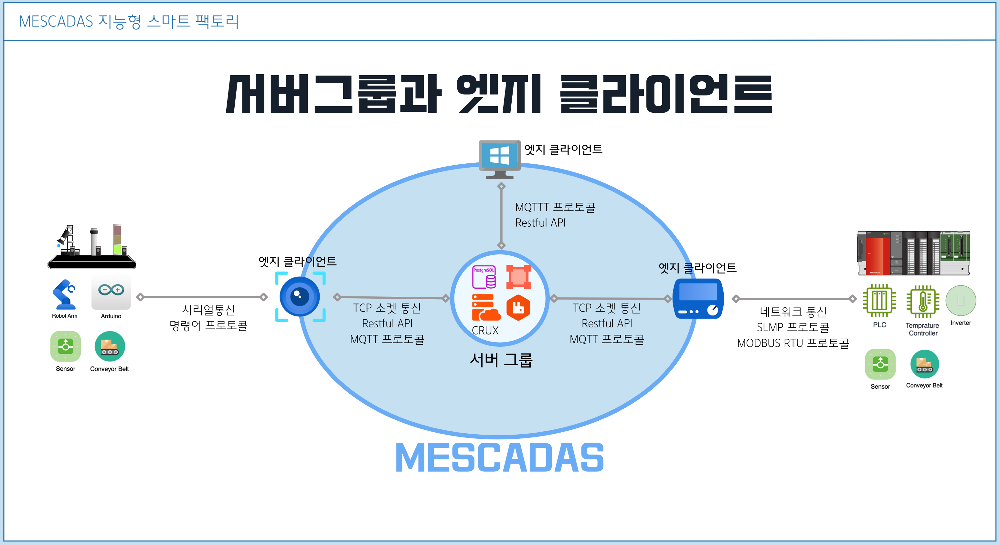
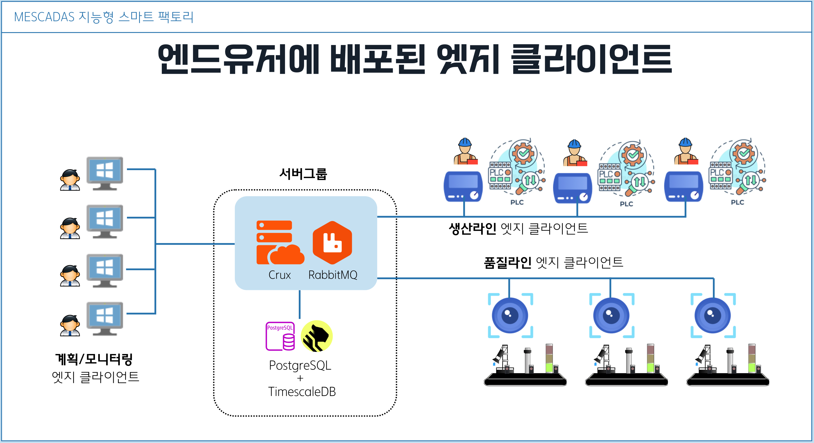
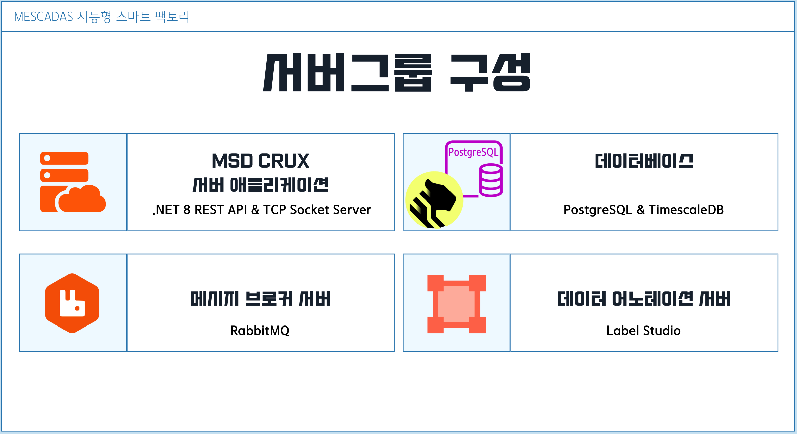
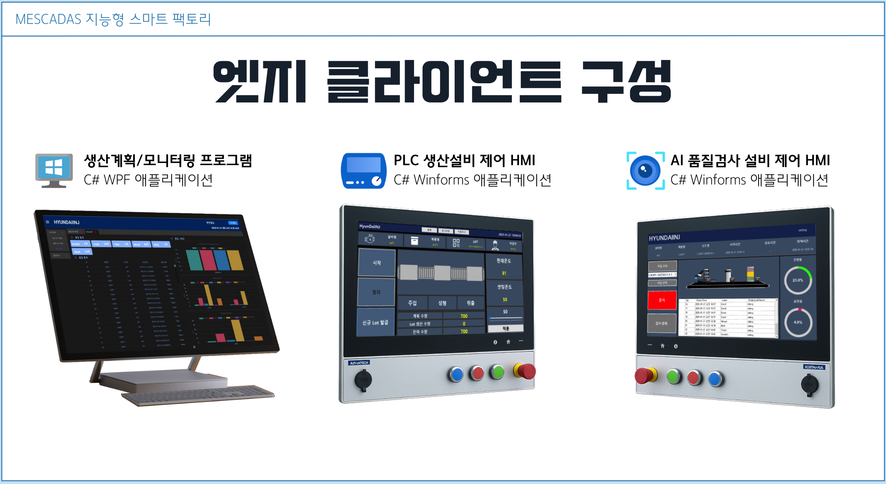

# MESCADAS - 지능형 스마트팩토리 시스템

## ■ MESCADAS 소개

MESCADAS(메스카다스, 이하 MSD)는 생산관리와 실시간 모니터링, AI를 이용한 불량판별 그리고 그것들을 위한 데이터 수집시스템을 C# .NET 스택으로 구현한 *클라우드 친화적*인 **지능형 스마트 팩토리** 시스템 입니다.

MSD는 여러 서버 애플리케이션과 클라이언트 소프트웨어가 하나의 큰 시스템을 이루고 있습니다. 본 사이트는 그 중 서버 애플리케이션인 MSD Crux의 문서 사이트입니다.

* [MSD Crux 서버 소스코드](https://github.com/KyleOpenGit/Msd-Crux-repo) (Github)
* [문서 페이지](docs/introduction.md)  (현재 사이트)

> [!NOTE]
> MESCADAS의 소스코드는 지능형 스마트팩토리 시스템의 개념을 시연할 수 있는 프로토타입으로, 실제 산업 현장에 적용된 사례는 아닙니다.

## ■ MESCADAS 전체 시스템 구성

### System Architecture

## 서버그룹과 엣지 클라이언트

#### MSD Crux 서버

- [소스코드](https://github.com/KyleOpenGit/Msd-Crux-repo) by 김카일
- [문서 페이지](docs/introduction.md)

MESCADAS의 중심에서 클라이언트와 데이터베이스 통신을 수행하는 Crux 서버 애플리케이션은 .Net Core로 개발된 크로스플랫폼 서버 애플리케이션으로, Windows 뿐만 아니라 Linux 에서도 실행될 수
있습니다.

#### Database

데이터베이스는 관계형 데이터와 시계열 데이터를 함께 다루기 위해 PostgreSQL & TimescaleDB 구성으로 이루어져있습니다.

#### Message Broker

메시지 브로커는 오픈소스 애플리케이션인 RabbitMQ가 실행되어 엣지 클라이언트들의 메시지 발행과 구독을 중계합니다.

#### 데이터 어노테이션 서버

데이터 어노테이션 서버는 MESCADAS 시스템이 작동하기위한 필수 서버는 아니지만 AI 학습에 사용되었습니다.

오픈소스 웹 애플리케이션이 Labe Studio는 MESCADAS의 품질검사 공정에 쓰이는 AI 학습을 위한 사진에 Labeling 하기위한 작업을 여러사람이 웹사이트에 로그인하여 협업할 수 있도록 해줍니다.
이로인해 방대한 량의 작업을 분담할 수 있습니다.
또한 여러 AI 학습모델의 트레이닝 데이터로 내보낼 수 있어, 추가적인 자동화를 구축하면 완료된 작업을 내보내 로컬 또는 클라우드 트레이닝 서버를 생성하여 학습을 실행할 수 있겠습니다.

엣지 클라이언트는 MESCADAS 시스템의 최전선에서 공장 사무실PC와 작업현장에서 관리자와 작업자와 밀접하게 상호작용 할 수 있는 UI를 갖추고, PLC 생산설비와 AI 품질 공정에서 데이터를 수집하여 서버로
전송합니다.

#### MSD MES

- [소스 코드](https://github.com/hmk904/HyunDaiINJ) by 한민기

MSD MES는 .NET WPF 프레임워크로 개발된 사무실 관리자용 프로그램으로, 생산계획 수립, 생산/품질검사 현황 모니터링을 수행할 수 있도록 개발되었습니다.

#### MSD PLC HMI

- [소스 코드](https://github.com/Appsperance/MES_Project) by 신종덕

MSD PLC HMI는 공장 생산라인 작업자가 콘트롤하는 전용 HMI 디바이스 컨셉의 윈도우 프로그램으로써, .NET Winforms로 개발되었습니다. PLC와 인버터, 온도콘트롤러를 통해 생산설비를 제어하며
데이터를 수집하고 서버로 전송합니다.

#### MSD Vision HMI

- [소스 코드](https://github.com/JoHB94/VP_QM_winform) by 조현빈

MESCADAS의 AI 품질검사 설비를 제어하는 MSD Vision HMI는 .NET Winforms로 개발되었습니다. Arduino를 시리얼통신 명령어 프로토콜로 제어하며 공장의 불량판별 기준으로 학습된 AI
모델을 내장하여 웹캠을 통해 비전검사를 수행하며, 데이터를 수집하여 서버로 전송합니다.

## ■ 통신 프로토콜

### Servers ⇔ Edge Clients 통신 프로토콜

서버와 클라이언트간 통신은 다음과 같습니다.

- RESTful API (표준 Web API)
- TCP Socket (OSI 4계층 커스텀 프로토콜)
- MQTT (메시지 브로커를 통한 Pub & Sub)

### Edge Clients ⇔ Devices 통신 프로토콜

산업현장의 다양한 [필드버스](https://en.wikipedia.org/wiki/Fieldbus) 프로토콜 중 일부와 커스텀 프로토콜이 구현되어 있습니다.

- MQTT 프로토콜 (인터넷, 메시지 브로커와의 Pub & Sub)
- MODBUS RTU 프로토콜 (RS485, 템코라인 온도콘트롤러, LS산전 인버터)
- SLMP 프로토콜 (이더넷, 미쯔비시 MELSEC PLC)
- 명령어 프로토콜 (시리얼통신, 아두이노 제어)

## ■ 시작하기

서버 구성에대해서는 [MSD Crux 서버 문서](docs/introduction.md) 에서 더 자세한 내용을 보실 수 있습니다.
